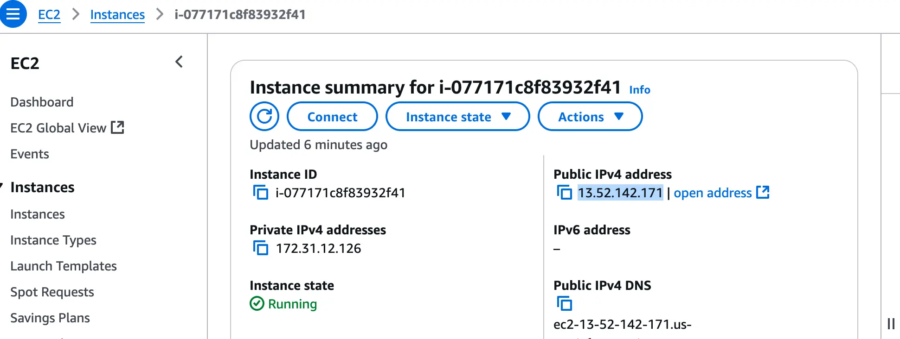
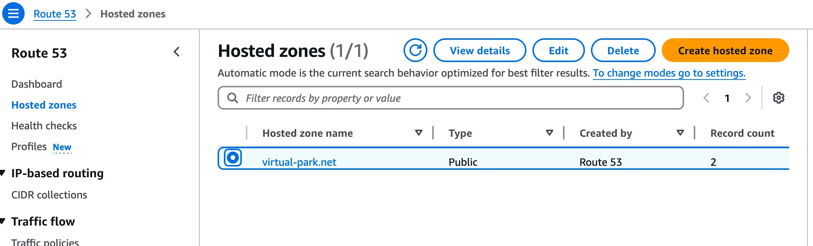
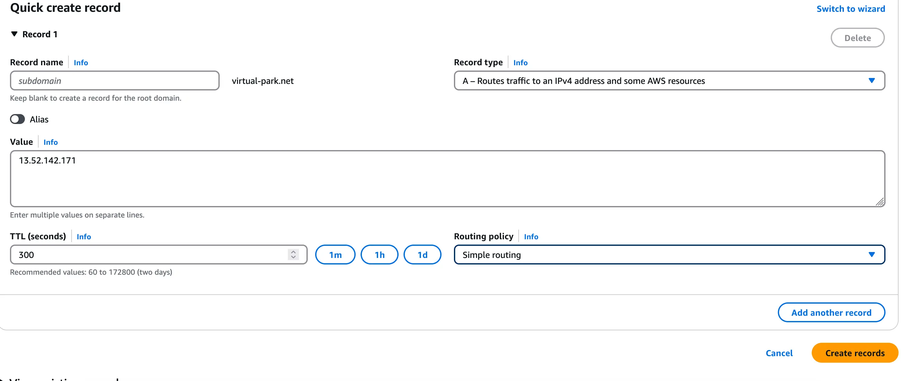
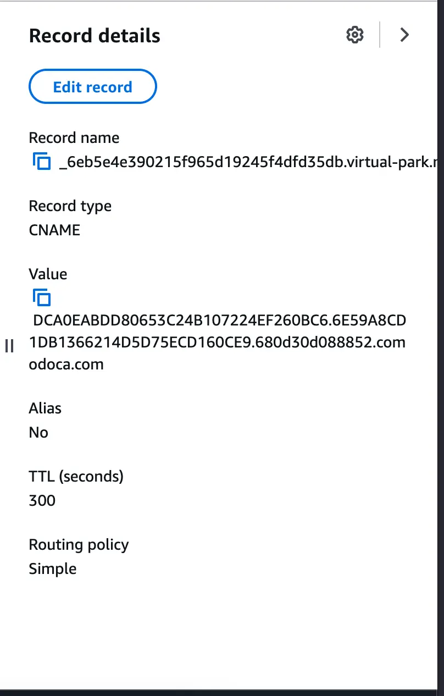

# AWS Route 53 Guide
Author: Jin Le

[AWS Guide Followed](https://docs.aws.amazon.com/Route53/latest/DeveloperGuide/routing-to-ec2-instance.html)
### My Steps
Navigate to Ec2 instance

Navigate to route 53 Hosted Zones

Click on virutal-park.net and go to 'create record'

### Settings of Record

### After Creation we now create new record for SSL certificate

