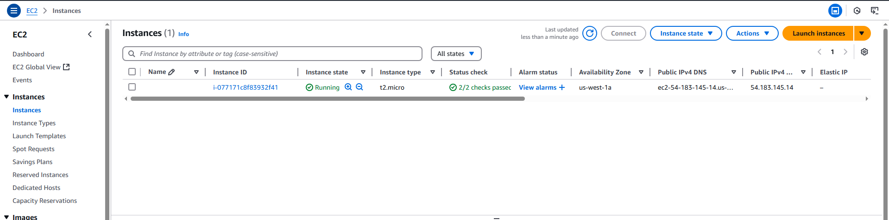
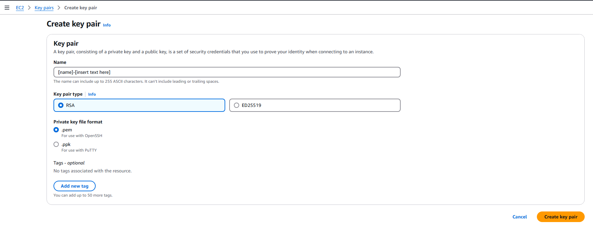

# Guide on Adding SSH Keys For EC2 Access
Author: Matthew Solomon
## Background
We want to allow each of our team members to access the EC2 instance so that any of us can perform any of the actions as we develop our project. For example, this could be installing/modifying our nginx setup, redeploying the app, and more. After canvassing AWS documentation, I found two approaches for giving users ssh access to the EC2 instance after it has been launched:

1. Create users with sudo permissions and authorize that user's ssh key
2. Attach an ssh-key to the main `ubuntu` user of the launched instance

For our purposes, we will use the second for two main reasons. The first is that we are all working on the same codebase, and hence will need to have constant access to the same files. The second is that it is much easier to manage the second method, and since there is a level of trust established through this being coursework, it works well enough.

As an aside, I will be using [] brackets for information you need to fill-in.

## Process
There are two main roles in this process:

1. The user who possesses the launched instance private key (Jin)
2. The users who do not (rest of team)

Each user has different steps they must take, and I provide the steps **IN SPECIFIC ORDER**, labeling them as I go.

### User Who Needs Access
We should have setup IAM accounts for you to access the EC2 console in AWS. If not, do not proceed and get that setup first.

Use the IAM account and navigate to the [EC2 Homepage](https://us-west-1.console.aws.amazon.com/ec2/home). Make sure the region is set to `us-west-1` (N. California).

Locate the Instances tab and make sure you can see our instance. It will appear as follows, but it should have the Key name `parking-permit-app-key`.



Next, navigate to `Network & Security` -> `Key Pairs` -> `Create key pair`. Create it with these settings, and give it any name you like, but make sure it includes your name.



Save the `.pem` to your `.ssh` folder (typically located in Users:/[username]). Open a cmd terminal and generate the public key using the following command:

```
ssh-keygen -y -f [yourprivatekey].pem
```

Take this public key and send it to the original private key holder (Jin).

### Instance Manager
Now, as the user who originally launched the EC2 instance, you **should** have the private key. If you do not, AWS states that there is **no way** to retrieve it, so you will have to rebuild the instance.

Otherwise, locate the Public IPv4 DNS OR Elastic IP in the EC2 console and ssh into the instance with the command:

```
ssh -i [instanceprivatekey].pem ubuntu@[Public IPv4 DNS/Elastic IP]
```

In the instance session, confirm the existence of the `.ssh` directory with `ls -a`. Locate the `.ssh/authorized_keys` file and open it with the editor of your choice.

```
[nano/vim] .ssh/authorized_keys
```

Take the public key from your teammate and add it as a new line in this file. **Note:** Make absolutely sure it was pasted on a separate line and on one line. If you have to, separate each public key by a blank line to protect the original public key. 

**DO NOT DELETE THE FIRST PUBLIC KEY UNDER ANY CIRCUMSTANCE.**

Save the file, then close the session.


## Closing
The user who provided the public key should now be able to ssh using the command

```
ssh -i [yourprivatekey].pem ubuntu@[Public IPv4 DNS/Elastic IP]
```

If there are any issues, first confirm that the correct public key was added as an authorized key. Then, ensure that you are utilizing the matching private key and have not modified it. 

If there are any issues, feel free to contact me and we will troubleshoot it.

**Warning**: I am new to this as I have never used EC2 in a group setting. Hence, I am unsure if there are any issues with having multiple users connected to the same user and instance. Perhaps it may not even be a problem as one could say that we **shouldn't** have multiple users connected as the reasons to ssh into the instance (deployments, nginx setup) are tasks to be done by one user at a time.
