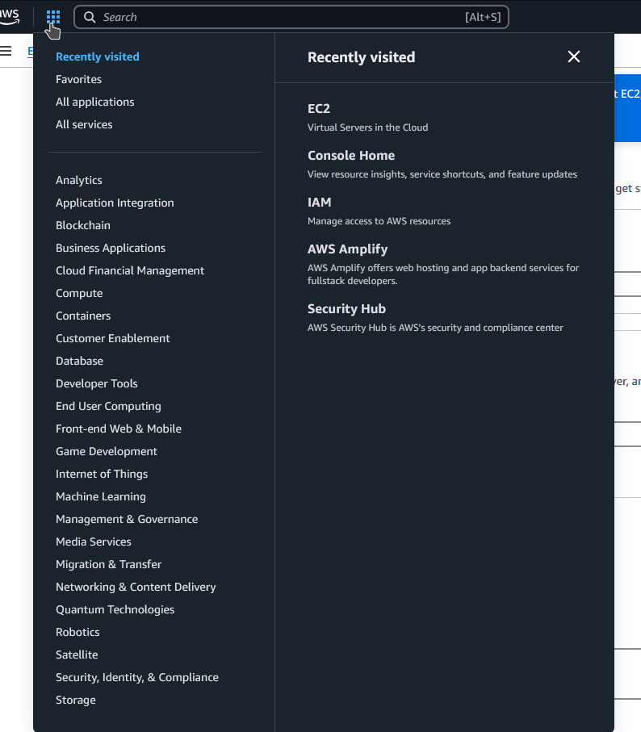
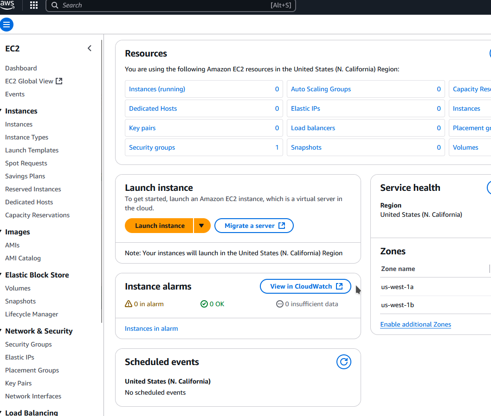
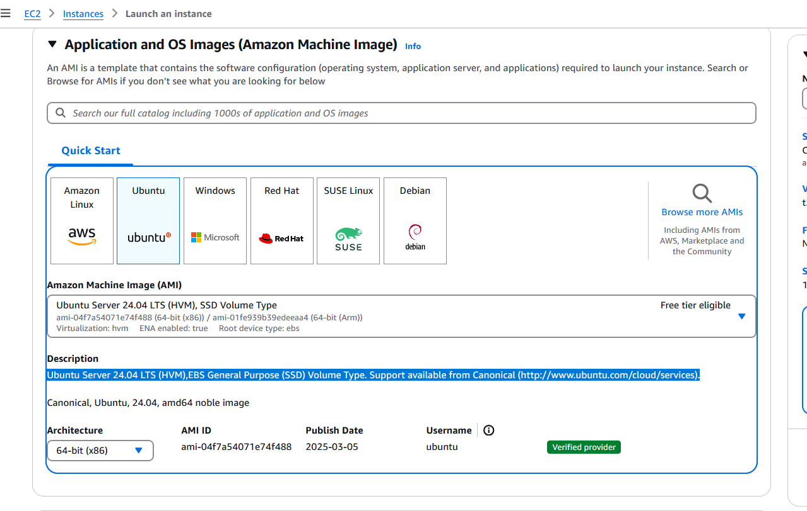
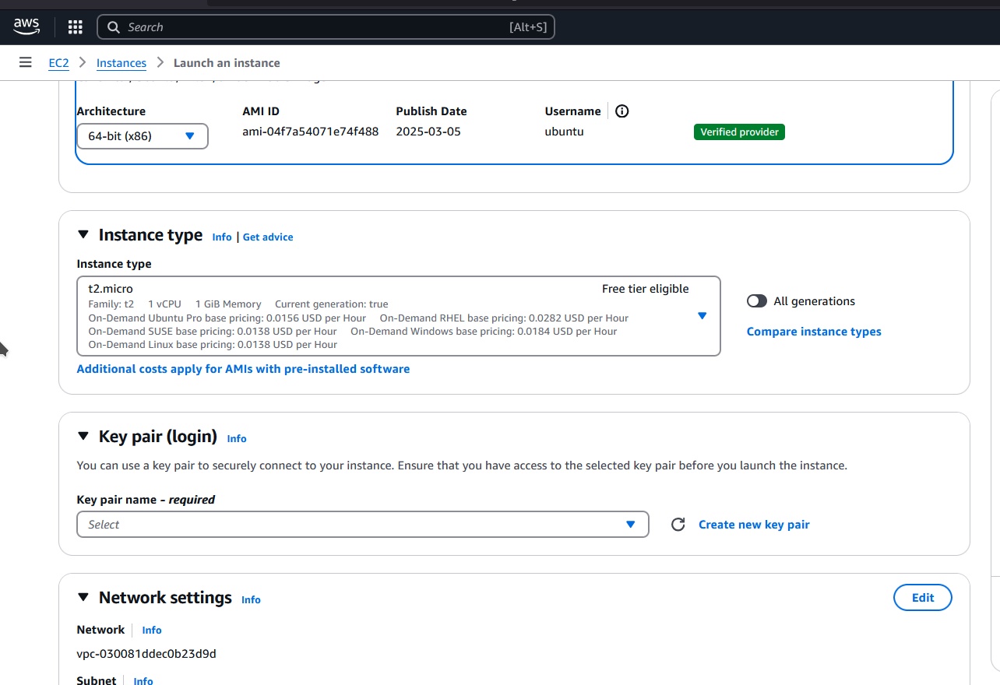
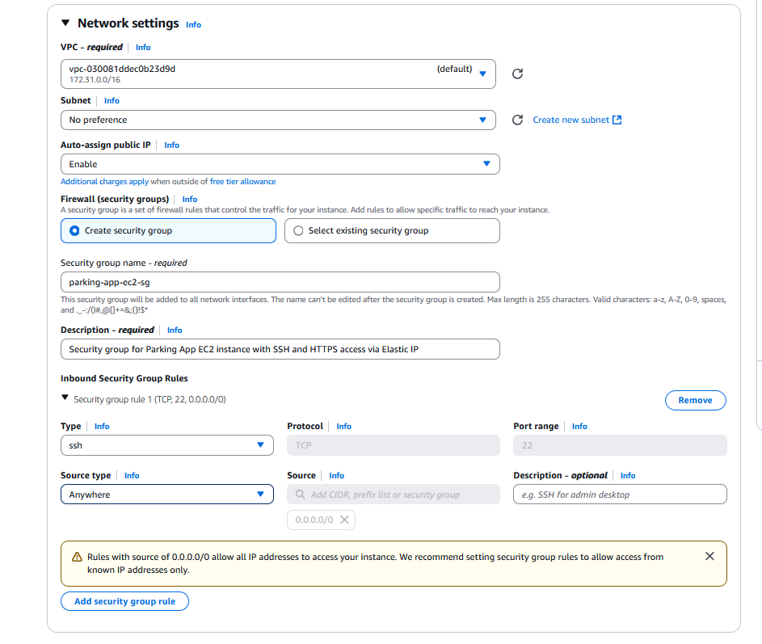
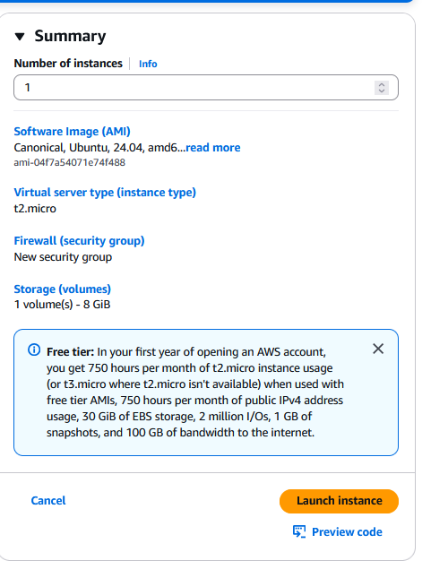
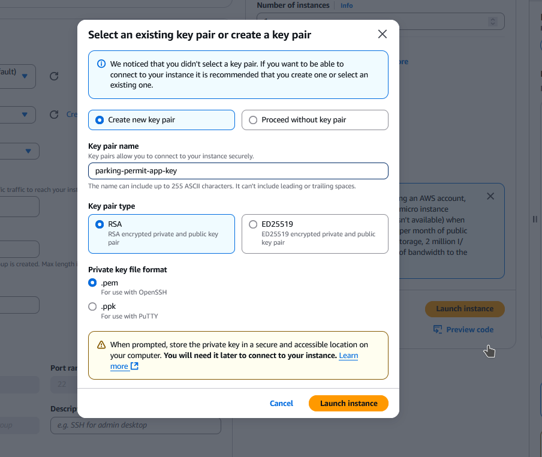
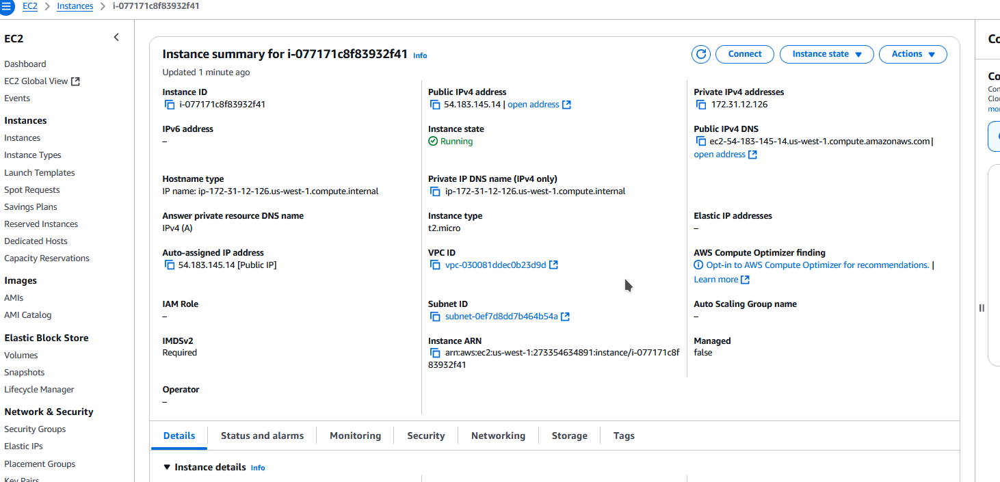

# AWS Setup Guide
Author: Jin Le
### Steps
- Create account at [aws amazon](https://aws.amazon.com/) and then sign into console as root user
### Creating EC2 Security Group
#### What is EC2
- is a web service that provides secure, resizable compute capacity in the cloud. It allows users to access virtual servers, called instances, on demand, which they can then use to run applications. (summary ig)
	- SSH 
- Virtual server 
[EC2 video](https://www.youtube.com/watch?v=eaicwmnSdCs)
- [Creating EC2](https://docs.aws.amazon.com/AWSEC2/latest/UserGuide/creating-security-group.html)

- Waffle Icon -> Compute -> EC2 

- Launch instance


### Launch Instance Settings





### Summary

After clicking launch instance


- with the key you download and then run the following commands
- If you are on windows you will have to use WSL
	- Place pem key into root directory or directory outside of windows
	- This works because WSL treats files in your **Linux home directory** (`~`) with proper Unix-style permissions. (chatgpt debugged this )
```
chmod 0400 {keyname}.pem
ssh -i parking-permit-app-key.pem ubuntu@54.183.145.14
```

### what everyone else has to proably do
- We will have to create IAM accounts and create our own access keys