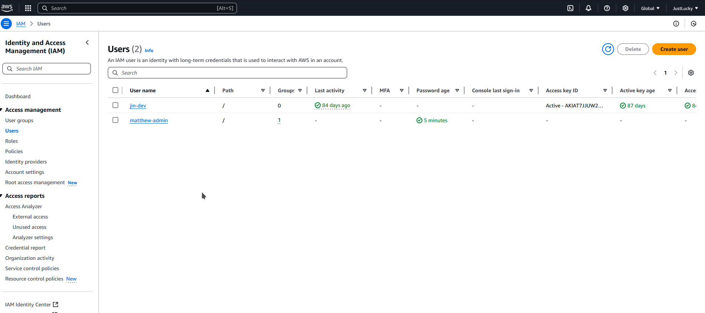
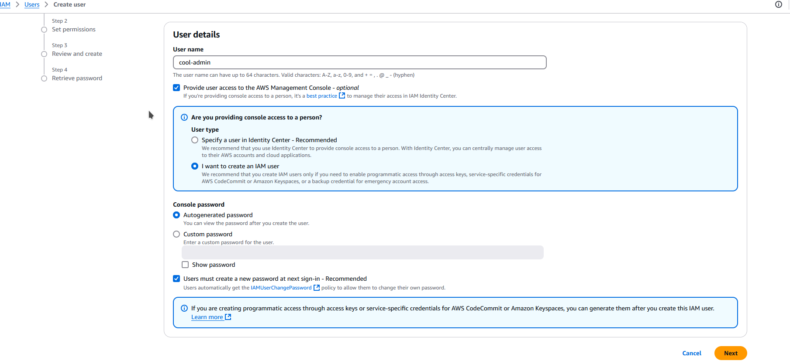
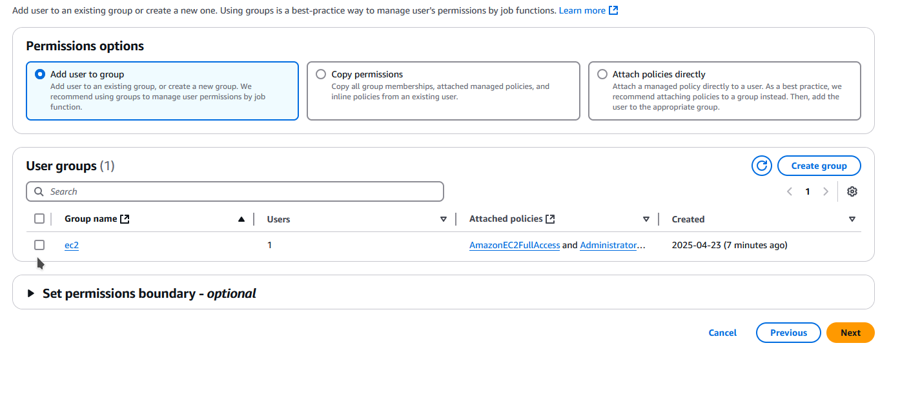
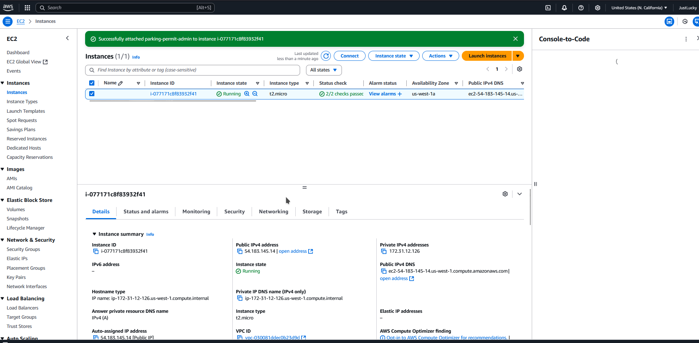
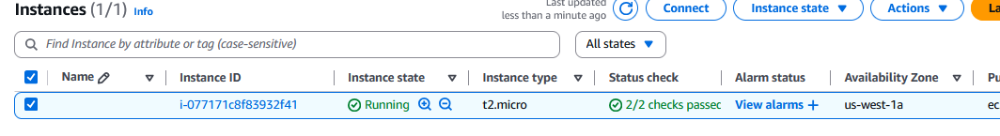
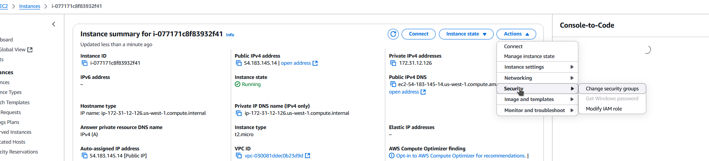
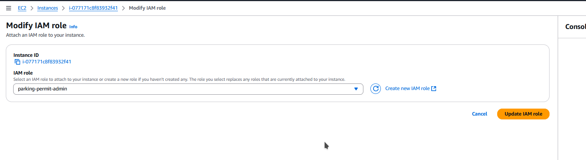
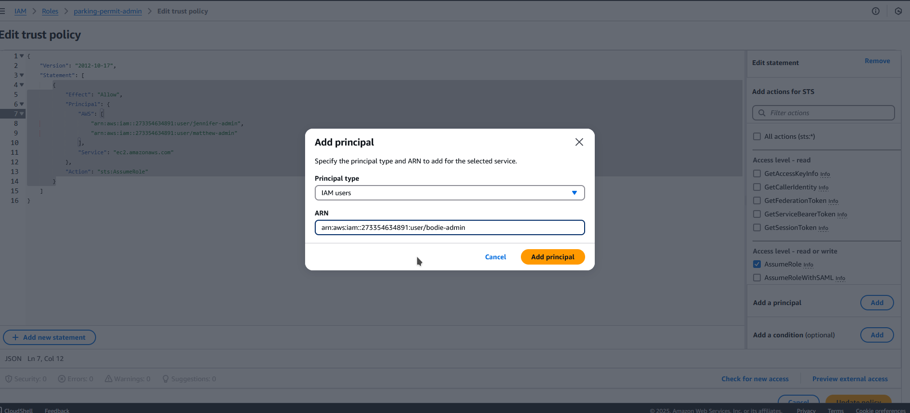

# IAM Account Creation Guide
Author: Jin Le

Create iam user here (not attached to ec2 instance yet)

### Attaching IAM Role to ec2 instance

SELECT-> Actions

Actions ->security->modify IAM Role

Attach iamrole

### Adding users to Admin Role
